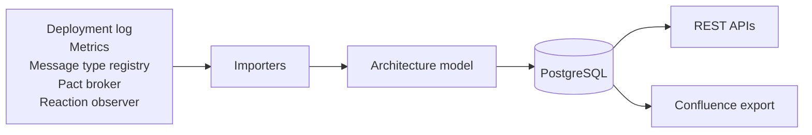

# jEAP Arch Repo Service

The jEAP Arch Repo Service maintains the **architecture inventory of a jEAP landscape**: which systems and
components exist, who owns them, which messages they exchange and which REST APIs they call. It imports that
inventory continuously from the systems that already know it - deployment logs, metrics, the message type
registry, the Pact broker - keeps it in one model in PostgreSQL, and exposes it over REST.

It is a **library**, not a deployable service: a jEAP microservice adds it as a Maven dependency and supplies the
configuration. See [Getting started](docs/getting-started.md).

## Documentation

| Topic                                                      | Contents                                                                         |
| ---------------------------------------------------------- | -------------------------------------------------------------------------------- |
| [Concepts](docs/concepts.md)                               | Why the arch repo exists, what it covers, and the conventions it relies on       |
| [Getting started](docs/getting-started.md)                 | Embedding the library into a microservice instance and running it                |
| [Architecture](docs/architecture.md)                       | The modules, the architecture model, and the two scheduled jobs                  |
| [Data model](docs/data-model.md)                           | The entities, their relationships and their tables                               |
| [Importers](docs/importers.md)                             | The importer plugin extension point and the importers that ship with the library |
| [API](docs/api.md)                                         | The REST API: the model, OpenAPI specs, database schemas and jobs                |
| [Docs API](docs/docs-api.md)                               | The segregated read API over the model, for the jEAP Doc Service                 |
| [Documentation generator](docs/documentation-generator.md) | The generated Confluence documentation                                           |
| [Operations](docs/operations.md)                           | The scheduled jobs, monitoring, and the maintenance that stays manual            |
| [Configuration](docs/configuration.md)                     | All configuration properties, with their defaults                                |
| [Security](docs/security.md)                               | The two authentication mechanisms and the semantic roles                         |

## Changes

This library is versioned using [Semantic Versioning](http://semver.org/) and all changes are documented in
[CHANGELOG.md](./CHANGELOG.md) following the format defined in [Keep a Changelog](http://keepachangelog.com/).

## Note

This repository is part the open source distribution of jEAP. See [github.com/jeap-admin-ch/jeap](https://github.com/jeap-admin-ch/jeap)
for more information.

## License

This repository is Open Source Software licensed under the [Apache License 2.0](./LICENSE).
