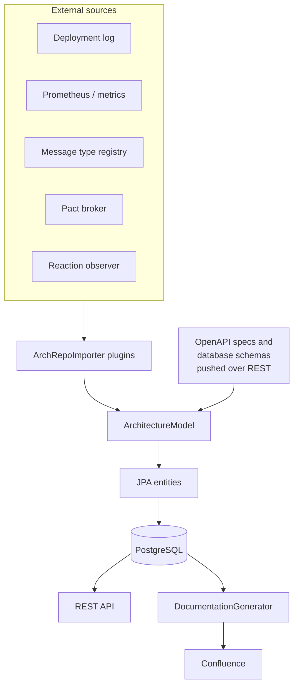

# Architecture

The arch repo service continuously assembles one **architecture model** of a jEAP landscape out of several
external sources, persists it in PostgreSQL, and publishes it - over REST, and as generated Confluence pages.

## Modules

| Module                         | Contents                                                                                                                                                                      |
| ------------------------------ | ----------------------------------------------------------------------------------------------------------------------------------------------------------------------------- |
| `jeap-archrepo-metamodel`      | The model itself: `ArchitectureModel`, `System`, `SystemComponent`, `Event`, `Command`, the relation types, `RestApi`, `OpenApiSpec`, `SystemComponentDatabaseSchema`, `Team` |
| `jeap-archrepo-persistence`    | The Spring Data repositories, `ArchitectureModelRepository`, and the Flyway migrations under `db/migration/common`                                                            |
| `jeap-archrepo-importers`      | The `ArchRepoImporter` extension point - see [Importers](importers.md)                                                                                                        |
| `jeap-archrepo-importer-*`     | One module per source, each activating itself only when its configuration is present                                                                                          |
| `jeap-archrepo-dbschema-model` | The `DatabaseSchema` record - the format components push their schema in                                                                                                      |
| `jeap-archrepo-docgen`         | The Confluence export - see [Documentation generator](documentation-generator.md)                                                                                             |
| `jeap-archrepo-web`            | The `@SpringBootApplication`, the REST controllers, the security configuration and the scheduled jobs                                                                         |
| `jeap-archrepo-test`           | Test support and the Pact contract test base classes, for instances                                                                                                           |
| `jeap-archrepo-instance`       | A `pom`-packaged aggregator pulling `web` and `test` together for a deployment                                                                                                |

## The model: a transient aggregate over persistent entities

`ArchitectureModel` is a plain in-memory object - a builder, **no `@Entity`** - holding a list of `System` and a
list of `Team`. Its contents *are* JPA entities, though: `System` is the aggregate root, owning its components,
events, commands, relations, REST APIs, OpenAPI specs and database schemas with cascade and orphan removal.

`ArchitectureModelRepository` bridges the two:

- `load()` assembles the transient model from `SystemRepository.findAll()` and `TeamRepository.findAll()`
- `save(model)` persists the whole graph back

An importer therefore never touches a repository. It receives the assembled model, changes it in memory, and the
caller saves it once at the end - which is what makes a run atomic.

### Provenance

Every element that an importer can create carries an `Importer` enum value naming the source it came from
(`GRAFANA`, `DEPLOYMENT_LOG`, `MESSAGE_TYPE_REGISTRY`, `PACT_BROKER`, `OPEN_API`, `REST_CONTROLLER`). That is what
lets a scheduled importer remove the elements that have disappeared from *its* source without touching anything
another source contributed, and it is what a generated page shows as "where this came from".

`SystemComponent` additionally carries `lastSeen`. A component that has not been seen for 14 days is
`isObsolete()`, and the metrics importers drop their own obsolete components at the end of their run.
[Operations](operations.md) has the full removal rules.

## The two scheduled jobs

Both live in `UpdateService` in `jeap-archrepo-web` and are guarded by ShedLock (`@SchedulerLock`), so only one
instance of a cluster runs them.

| Job                       | Schedule                                           | What it does                                                                                                             |
| ------------------------- | -------------------------------------------------- | ------------------------------------------------------------------------------------------------------------------------ |
| `updateModel()`           | `archrepo.update-schedule`                         | Loads the model, runs every registered importer in `getOrder()` sequence, cleans up stale REST elements, saves the model |
| `generateDocumentation()` | `archrepo.documentation-generator.update-schedule` | Loads the model and renders it to Confluence                                                                             |

Both are `@Transactional` and save once at the end, which makes a run atomic: an importer that throws rolls the
whole run back and leaves the previous model in place.

Both can also be triggered on demand over `POST /api/jobs` - see [API](api.md).

Each run is tracked by a `SchedulerRunTracker`, which records the run and publishes a Micrometer gauge
(`archrepo_model_update_last_run_from`, `archrepo_generate_documentation_last_run_from`) so that a stalled
scheduler is visible in monitoring - see [Operations](operations.md).

## Not all ingestion is scheduled

OpenAPI specs and database schemas are **pushed in synchronously** by the components themselves, over
`POST /api/openapi/{systemComponentName}` and `POST /api/dbschemas`. Those importers are plain Spring components,
not `ArchRepoImporter` plugins, because they run in the request rather than in the scheduled sweep.

## Related

- [Concepts](concepts.md) - why the arch repo exists and what it covers
- [Data model](data-model.md) - the entities behind the model, in detail
- [Importers](importers.md) - the extension point and the importers that ship with the library
- [API](api.md) - what the model is published over
- [Documentation generator](documentation-generator.md) - the Confluence export
- [Operations](operations.md) - running the jobs and monitoring them
- [Configuration](configuration.md) - the schedules and the source configuration
