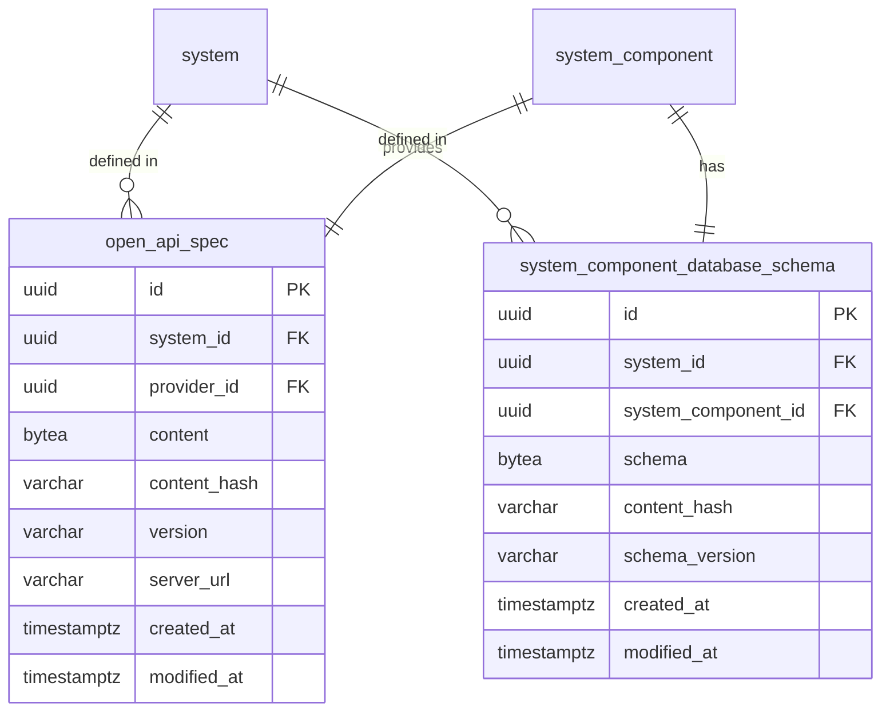
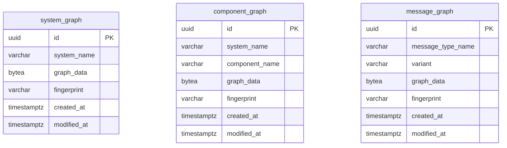
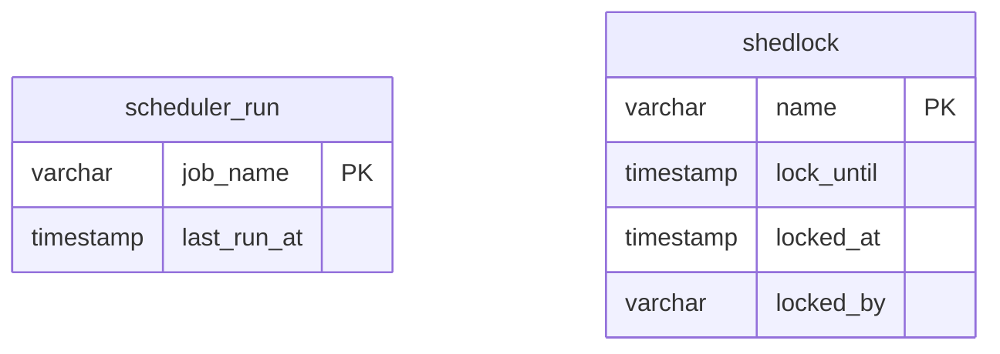

# Data model

The entities live in `jeap-archrepo-metamodel` and are ordinary JPA entities. `ArchitectureModel` is the transient
aggregate the importers work on; it is assembled from and written back to these entities by
`ArchitectureModelRepository` - see [Architecture](architecture.md).

All tables are created by the Flyway migrations of `jeap-archrepo-persistence` in the database schema `data`.
There are eighteen of them, plus Flyway's own `flyway_schema_history`. Every one is documented below, grouped by
what it belongs to.

## The system aggregate

`System` is the aggregate root. A system is owned by a team, may be known under several aliases, and holds the
components deployed for it.

```mermaid
erDiagram
    team ||--o{ system : "default owner"
    team ||--o{ system_component : owns
    system ||--o{ system_aliases : "known as"
    system ||--o{ system_component : contains

    team {
        uuid id PK
        varchar name UK
        varchar contact_address
        varchar jira_link
        varchar confluence_link
        timestamptz created_at
        timestamptz modified_at
    }
    system {
        uuid id PK
        varchar name UK
        uuid default_owner_id FK
        varchar description
        varchar confluence_link
        timestamptz created_at
        timestamptz modified_at
    }
    system_aliases {
        uuid system_id PK_FK
        varchar aliases PK
    }
    system_component {
        uuid id PK
        varchar name UK
        uuid system_id FK
        uuid team_id FK
        varchar type
        varchar description
        varchar importer
        timestamptz created_at
        timestamptz last_seen
    }
```

`system_component.name` is unique across the whole landscape, not per system - which is why a component can be
looked up by name alone, and why the naming conventions of [Concepts](concepts.md) matter.

`system_component.type` is the JPA discriminator and decides the subclass:

| Subclass                 | `SystemComponentType`   | Created for                                           |
| ------------------------ | ----------------------- | ----------------------------------------------------- |
| `BackendService`         | `BACKEND_SERVICE`       | Any name without a recognised suffix                  |
| `Frontend`               | `FRONTEND`              | `-ui`, `-frontend`, `-webui`                          |
| `Gateway`                | `GATEWAY`               | `-gateway`                                            |
| `SelfContainedSystem`    | `SELF_CONTAINED_SYSTEM` | `-scs`                                                |
| `MobileApp`              | `MOBILE_APP`            | Nothing - the type exists but no importer produces it |
| `UnknownSystemComponent` | `UNKNOWN`               | Nothing - as above                                    |

`importer` records which source last claimed the component, and `last_seen` when it was last found; a component
unseen for 14 days is `isObsolete()` and is dropped by the metrics importers - see [Importers](importers.md).

## Messages

The events and commands a system defines, their versions, and which component holds which contract on them.

```mermaid
erDiagram
    system ||--o{ message_type : defines
    message_type ||--o{ message_type_versions : "has versions"
    message_type ||--o{ message_contract : "sender / receiver / publisher / consumer"

    message_type {
        uuid id PK
        uuid system_id FK
        varchar message_type_name
        varchar type
        varchar scope
        varchar topic
        varchar description
        varchar descriptor_url
        varchar documentation_url
        varchar importer
    }
    message_type_versions {
        uuid message_type_id PK_FK
        varchar version PK
        varchar key_schema_name
        varchar key_schema_url
        varchar key_schema_resolved
        varchar value_schema_name
        varchar value_schema_url
        varchar value_schema_resolved
        varchar compatible_version
        varchar compatibility_mode
    }
    message_contract {
        uuid id PK
        uuid message_sender_id FK
        uuid message_receiver_id FK
        uuid message_publisher_id FK
        uuid message_consumer_id FK
        varchar component_name
        varchar topic
        varchar versions
    }
```

`message_type.type` is the discriminator: `EVENT` or `COMMAND`. Which of the four nullable foreign keys of
`message_contract` is set is what encodes the role - an event has publishers and consumers, a command senders and
receivers - so exactly one of them is set per row. `versions` is a comma-separated list, read back by
`MessageContract.versionList()`.

The `*_schema_resolved` columns of `message_type_versions` hold a **rendering** of the Avro IDL file, produced by
`SchemaImportResolver` when the message type is imported: imports inlined and marked with comments, base types
dropped, namespaces and enclosing braces removed. The file itself is not stored - `*_schema_url` is where it can
be read - so the rendering cannot be changed without importing the message types again. It is what the
[docs API](docs-api.md) serves as `resolvedSchema`, which is the only consumer of these six columns besides the
Confluence documentation generator.

## REST APIs and relations

A relation is an edge between two components. It is stored by **name**, not by foreign key, because the consumer
may not exist as a component yet when the relation is imported.

```mermaid
erDiagram
    system ||--o{ rest_api : defines
    system_component ||--o{ rest_api : provides
    rest_api ||--o{ rest_api_importers : "seen by"
    system ||--o{ relation : defines
    rest_api |o--o{ relation : "called by"
    relation ||--o{ relation_importers : "seen by"

    rest_api {
        uuid id PK
        uuid system_id FK
        uuid provider_id FK
        varchar method
        varchar path
        timestamptz created_at
        timestamptz modified_at
    }
    rest_api_importers {
        uuid rest_api_id PK_FK
        varchar importers PK
    }
    relation {
        uuid id PK
        varchar type
        uuid system_id FK
        uuid rest_api_id FK
        varchar provider_name
        varchar consumer_name
        varchar event_name
        varchar command_name
        varchar pact_url
        varchar status
        timestamptz last_seen
    }
    relation_importers {
        uuid relation_id PK_FK
        varchar importers PK
    }
```

`relation.type` discriminates `REST_API`, `EVENT` and `COMMAND` relations, and decides which of `rest_api_id`,
`event_name` and `command_name` is used. `status` is `ACTIVE` or `DELETED` - only active relations are published.

`rest_api_importers` and `relation_importers` are element collections: one row per importer that has seen the
element, which is what lets one source withdraw its claim without deleting something another source still sees.

## Pushed artifacts

The only two tables a component writes to itself, over the REST API - see [API](api.md).



There is **at most one of each per component**: `open_api_spec` is unique on `(system_id, provider_id)` and
`system_component_database_schema` on `system_component_id`. A push updates the row in place rather than adding a
version, so there is no history.

`content_hash` is the lowercase hex SHA-256 of the stored bytes. It is what the
[docs API](docs-api.md) serves as an entity tag, so that a consumer can tell whether an artifact changed without
fetching it. It is written when the artifact is stored; artifacts that predate the column were filled once by the
`V2_6_0` migration. `open_api_spec.content` is nullable, so a spec can exist without content and then has no hash;
`system_component_database_schema.schema` is `NOT NULL`.

## Reaction graphs

Written directly by the reaction observer importer rather than through `ArchitectureModelRepository`. They
reference systems, components and message types **by name**, with no foreign key.



`graph_data` is the rendered graph; `fingerprint` is the hash of the data it was rendered from, which is how the
importer decides whether a graph has to be re-rendered. `message_graph` is unique on
`(message_type_name, variant)`.

## Operational tables

Not part of the architecture model - they carry the state the runtime needs.



| Table                   | Written by  | What it is                                                                                                                             |
| ----------------------- | ----------- | -------------------------------------------------------------------------------------------------------------------------------------- |
| `scheduler_run`         | the service | One row per scheduled job with its last successful run, which the monitoring gauges are derived from - see [Operations](operations.md) |
| `shedlock`              | ShedLock    | The cluster lock that keeps the two scheduled jobs from running twice at once                                                          |
| `flyway_schema_history` | Flyway      | Which migrations have been applied. Not to be edited by hand                                                                           |

## Auditing

Entities extending `MutableDomainEntity` carry `created_at` and `modified_at`, set by the JPA callbacks
`@PrePersist` and `@PreUpdate`. Both getters are `protected`, so the timestamps are not part of the public model -
the docs API reports `coalesce(modified_at, created_at)` for an artifact instead.

Because the callbacks are JPA's, a bulk update or a Flyway migration does **not** touch `modified_at`. The
`V2_6_0` backfill relies on that: filling a content hash must not make an artifact look freshly published.

## Related

- [Architecture](architecture.md) - the transient model over these entities
- [Concepts](concepts.md) - the naming conventions the model is built on
- [Importers](importers.md) - what fills each entity
- [API](api.md) - how the model is published
- [Docs API](docs-api.md) - the read API the content hash exists for
