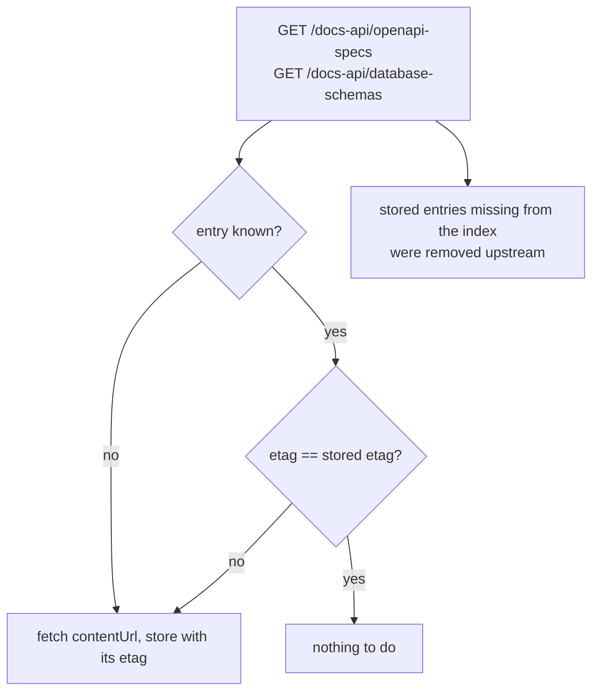

# The docs API

`/docs-api` is a **segregated read API over the architecture model**, added for the jEAP Doc Service, which
generates the architecture documentation out of it. It is separate from `/api/**` in every respect that matters:
its own root, its own payloads, its own authentication and its own error format.

Nothing under `/api/**` or `/external-api/**` is changed by it. See [API](api.md) for those.

This page first states the rules that hold for every resource, then documents each of the seven resources on its
own - request, payload and every status it can answer with.

## Why it is separate

|                    |                                                                                                                                                                                                                               |
| ------------------ | ----------------------------------------------------------------------------------------------------------------------------------------------------------------------------------------------------------------------------- |
| **Authentication** | `/api/**` is served by a filter chain using HTTP basic with several public `GET`s. Under that root the new resources would inherit those defaults; here **every** resource requires a bearer token and a semantic role        |
| **Payloads**       | `/api/model` is consumed by other services and is under Pact contract. Every field the documentation needs would otherwise be a change to a contracted payload. The docs API has its own DTOs and can grow with the generator |
| **Caching**        | The documentation generator re-reads the model on every run. The docs API answers conditional requests, so an unchanged landscape costs a handful of `304`s                                                                   |

## The resources

All seven are `GET`, read-only, and require the same role.

| Method and resource                                                     | Purpose                                                       |
| ----------------------------------------------------------------------- | ------------------------------------------------------------- |
| `GET /docs-api/systems`                                                 | Every system, with its team and aliases                       |
| `GET /docs-api/systems/{system}`                                        | One system with its components and relations                  |
| `GET /docs-api/systems/{system}/messages`                               | The events and commands defined by a system                   |
| `GET /docs-api/systems/{system}/components/{component}/openapi`         | The OpenAPI spec of a component                               |
| `GET /docs-api/systems/{system}/components/{component}/database-schema` | The database schema of a component                            |
| `GET /docs-api/openapi-specs`                                           | Index of every published OpenAPI spec, with its entity tag    |
| `GET /docs-api/database-schemas`                                        | Index of every published database schema, with its entity tag |

`{system}` is matched by **name or alias**, ignoring case; `{component}` is matched by name, ignoring case, and
must belong to the system in the path. The same resolution applies to the `system` query parameter of the two
indexes.

A generation run costs: the system list once, the export and the messages per system, the two indexes once, and a
content resource only for an artifact whose entity tag actually moved.

> **All four model resources assemble the whole architecture model per request** - the system list too, even
> though its payload is small: it is light in what it returns, not in what it costs. The per-system resources need
> the full model because a system's relations include those defined by other systems and the payload names the
> owning system of every component. The cost therefore grows with systems x landscape size. That is acceptable at
> the current size and for a generation run that happens a few times a day; it is the first thing to change if
> either grows. The two content resources and the two indexes do not load the model.

## Conditional requests

Every resource carries a strong `ETag` and honours `If-None-Match` with `304 Not Modified`, which has an empty
body. `Cache-Control` is `no-cache`: a consumer revalidates, but an unchanged resource costs no payload.

The tag is `"sha256:<hex>"`. For the five model resources it is computed over the serialized response body, so it
changes exactly when the response would. For the two content resources it is the hash of the **stored bytes** of
the artifact, which is what makes the following contract hold:

> The `etag` of an entry in an index is **byte-identical** to the `ETag` header of the resource its `contentUrl`
> names.

That is the point of the indexes: a consumer compares the two without making a request, and fetches only what
changed. It can also send the stored value as `If-None-Match`, so an artifact that changes between the index call
and the fetch costs a cheap `304` rather than a wrong result.

The indexes list what is **available**, not what changed - an index that omitted unchanged entries could not tell
"unchanged" from "deleted". For the same reason there is no `since` parameter.

A replication run therefore looks like this:



The hash is stored with the artifact, so an index does not read any blob and a `304` does not read the blob it is
about to not return. It is written when the artifact is stored; artifacts that predate the column were filled by
the `V2_6_0` migration, which runs before the service accepts requests. **No request ever writes it** - that is
what lets these reads be routed to a read replica, and it is why a read cannot make an artifact look freshly
published by bumping its `lastModifiedAt`.

## One representation per resource

Every resource serves `application/json` and nothing else; another `Accept` is answered with `406`. A request
without an `Accept` header, or with `*/*`, is served normally.

That includes the OpenAPI spec resource, whose body is the stored spec itself, without a wrapper. A stored spec is
always JSON, because the push endpoint parses it as JSON before storing it - see [API](api.md). Serving a second
representation would also break the contract above: the entity tag is the hash of the stored bytes, and one hash
cannot describe two different bodies.

## Links in the payloads

`contentUrl` is a **path, not a full URL** - and it carries the service's context path, so
`/my-archrepo-service/docs-api/systems/wvs/components/wvs-foo-bar-service/openapi`. Resolving it against the base
URL the consumer already called therefore yields the resource again. Outside a request - in a unit test, or on a
service that runs at the root - there is no context path to prepend and the path starts at `/docs-api`.

It deliberately carries no host. A service and a browser may reach the arch repo under different hosts, so no
single absolute URL is right for both, and a consumer resolving against the base it used is correct by
construction.

`swaggerUrl` is the exception and is absolute, because a **browser** follows it from the generated page. It is
built from `archrepo.openapi-base-url` - which the instance already configures with the browser-reachable prefix -
followed by the system name and the component name, lower-cased.

## Security

Every resource requires the semantic role `architecture-model` / `read`, which resolves to
`<system-name>_@architecture-model_#read`. There is no public and no merely authenticated resource under
`/docs-api`.

| Situation                                      | Answer                                           |
| ---------------------------------------------- | ------------------------------------------------ |
| No token, or an invalid one                    | `401`                                            |
| The HTTP basic credentials that open `/api/**` | `401` - the docs API is not on that filter chain |
| A token without the role                       | `403`                                            |
| A token with `architecture-model` / `write`    | `403` - the operation is part of the role        |
| The role issued for another system             | `403` - so is the system                         |

Granting the role to a doc service client on an instance whose system name is `my-system` therefore means
granting `my-system_@architecture-model_#read`, and nothing else - the docs API needs no write role.

See [Security](security.md) for how this fits with the rest of the service.

## Errors

Errors of the docs API are [RFC 9457](https://www.rfc-editor.org/info/rfc9457/) problem documents,
`application/problem+json`. This is the only part of the service that answers that way; the existing endpoints
keep their plain-text errors.

```json
{
  "type": "https://jeap.admin.ch/problems/archrepo/system-not-found",
  "title": "System not found",
  "status": 404,
  "detail": "No system or alias named 'no-such-system'",
  "instance": "/docs-api/systems/no-such-system"
}
```

| Status | `type`                      | When                                                                                    |
| ------ | --------------------------- | --------------------------------------------------------------------------------------- |
| `404`  | `system-not-found`          | No system of that name or alias, including in the `system` filter of an index           |
| `404`  | `component-not-found`       | The system has no such component, or the component exists but belongs to another system |
| `404`  | `openapi-spec-not-found`    | The component has published no spec, or the stored row has no content                   |
| `404`  | `database-schema-not-found` | The component has published no schema                                                   |

The four `404` kinds are named apart because a generator has to tell a mistake ("no such system") from a normal
state ("this component has no OpenAPI spec").

`401`, `403` and `406` are decided by the filter chain and by content negotiation, before the docs API's own
handler runs, and therefore carry no problem `type`.

## `GET /docs-api/systems`

Every system of the landscape, sorted by name. The index a generation run iterates over, and deliberately light:
no components and no relations.

### Request

`GET /docs-api/systems`

No path parameters and no query parameters.

| Request header  | Required | Value                                                              |
| --------------- | -------- | ------------------------------------------------------------------ |
| `Authorization` | yes      | `Bearer` token carrying the role below                             |
| `Accept`        | no       | `application/json` or `*/*`; anything else is `406`                |
| `If-None-Match` | no       | An `ETag` from an earlier response; a match is answered with `304` |

Role: `architecture-model` / `read`.

### Response

`200 OK`, `application/json`.

| Response header | Value                                     |
| --------------- | ----------------------------------------- |
| `ETag`          | `"sha256:<hex>"` over the serialized body |
| `Cache-Control` | `no-cache`                                |

```json
{
  "systems": [
    {
      "name": "wvs",
      "description": "Warenverkehrssystem",
      "aliases": ["WVS-ALIAS"],
      "team": {
        "name": "Team Blue",
        "contactAddress": "team-blue@example.com",
        "jiraLink": "https://jira.example.com/projects/WVS",
        "confluenceLink": "https://confluence.example.com/display/WVS"
      }
    },
    {
      "name": "zoll",
      "aliases": []
    }
  ]
}
```

| Field                   | Type            | Meaning                                              | Absent when                                         |
| ----------------------- | --------------- | ---------------------------------------------------- | --------------------------------------------------- |
| `systems`               | array           | Every system, sorted by `name`                       | never - an empty landscape is an empty array        |
| `systems[].name`        | string          | The system's name, and what `{system}` matches first | never                                               |
| `systems[].description` | string          | Free text from the importers                         | the system has none                                 |
| `systems[].aliases`     | array of string | Further names the system is known under, sorted      | never - a system without aliases has an empty array |
| `systems[].team`        | object          | The system's default owner                           | the system has no default owner                     |
| `team.name`             | string          | The team's name                                      | the team has none                                   |
| `team.contactAddress`   | string          | The team's contact address                           | the team has none                                   |
| `team.jiraLink`         | string          | The team's Jira project                              | the team has none                                   |
| `team.confluenceLink`   | string          | The team's Confluence space                          | the team has none                                   |

| Status | `type` | When                                                                   |
| ------ | ------ | ---------------------------------------------------------------------- |
| `304`  | -      | `If-None-Match` matched                                                |
| `401`  | -      | No token, or one the resource server rejects                           |
| `403`  | -      | The token does not carry `architecture-model` / `read` for this system |
| `406`  | -      | `Accept` allows neither `application/json` nor `*/*`                   |

## `GET /docs-api/systems/{system}`

One system with its components and its relations - everything the system page and its component pages need, in one
response.

### Request

`GET /docs-api/systems/{system}`

| Path parameter | Matches                                                    |
| -------------- | ---------------------------------------------------------- |
| `system`       | The system's **name or one of its aliases**, ignoring case |

No query parameters.

| Request header  | Required | Value                                                              |
| --------------- | -------- | ------------------------------------------------------------------ |
| `Authorization` | yes      | `Bearer` token carrying the role below                             |
| `Accept`        | no       | `application/json` or `*/*`; anything else is `406`                |
| `If-None-Match` | no       | An `ETag` from an earlier response; a match is answered with `304` |

Role: `architecture-model` / `read`.

### Response

`200 OK`, `application/json`.

| Response header | Value                                     |
| --------------- | ----------------------------------------- |
| `ETag`          | `"sha256:<hex>"` over the serialized body |
| `Cache-Control` | `no-cache`                                |

```json
{
  "name": "wvs",
  "description": "Warenverkehrssystem",
  "aliases": ["WVS-ALIAS"],
  "team": {
    "name": "Team Blue",
    "contactAddress": "team-blue@example.com",
    "jiraLink": "https://jira.example.com/projects/WVS",
    "confluenceLink": "https://confluence.example.com/display/WVS"
  },
  "components": [
    {
      "name": "wvs-foo-bar-service",
      "description": "Handles foo and bar",
      "type": "BACKEND_SERVICE",
      "team": { "name": "Team Blue", "contactAddress": "team-blue@example.com" },
      "importer": "DEPLOYMENT_LOG",
      "lastSeen": "2026-08-12T04:00:00Z",
      "restApis": [ { "method": "GET", "path": "/api/foo/{id}" } ],
      "openApi": {
        "version": "1.4.2",
        "serverUrl": "https://foo-bar.example.com",
        "contentUrl": "/my-archrepo-service/docs-api/systems/wvs/components/wvs-foo-bar-service/openapi",
        "swaggerUrl": "https://archrepo.example.com/archrepo-service/swagger-ui/index.html?url=/archrepo-service/api/openapi/wvs/wvs-foo-bar-service"
      },
      "databaseSchema": {
        "schemaVersion": "42",
        "contentUrl": "/my-archrepo-service/docs-api/systems/wvs/components/wvs-foo-bar-service/database-schema"
      }
    }
  ],
  "relations": [
    {
      "type": "REST_API_RELATION",
      "consumerSystem": "zoll",
      "consumer": "zoll-gateway",
      "providerSystem": "wvs",
      "provider": "wvs-foo-bar-service",
      "method": "GET",
      "path": "/api/foo/{id}",
      "pactUrl": "https://pactbroker.example.com/pacts/foo"
    },
    {
      "type": "EVENT_RELATION",
      "consumerSystem": "zoll",
      "consumer": "zoll-gateway",
      "providerSystem": "wvs",
      "provider": "wvs-foo-bar-service",
      "messageType": "WvsDeclarationAcceptedEvent"
    }
  ]
}
```

| Field                          | Type               | Meaning                                                                                                                                                | Absent when                                        |
| ------------------------------ | ------------------ | ------------------------------------------------------------------------------------------------------------------------------------------------------ | -------------------------------------------------- |
| `name`                         | string             | The system's stored name, whether the path used the name or an alias                                                                                   | never                                              |
| `description`                  | string             | Free text from the importers                                                                                                                           | the system has none                                |
| `aliases`                      | array of string    | Further names the system is known under, sorted                                                                                                        | never                                              |
| `team`                         | object             | The system's default owner, with the same fields as in the system list                                                                                 | the system has no default owner                    |
| `components`                   | array              | The system's components, sorted by `name`                                                                                                              | never                                              |
| `components[].name`            | string             | The component's name, and what `{component}` matches                                                                                                   | never                                              |
| `components[].description`     | string             | Free text from the importers                                                                                                                           | the component has none                             |
| `components[].type`            | enum               | `BACKEND_SERVICE`, `FRONTEND`, `GATEWAY`, `MOBILE_APP`, `SELF_CONTAINED_SYSTEM` or `UNKNOWN`                                                           | never                                              |
| `components[].team`            | object             | The component's own team, falling back to the system's default owner                                                                                   | neither is set                                     |
| `components[].importer`        | enum               | Which source the component was imported from: `GRAFANA`, `DEPLOYMENT_LOG`, `MESSAGE_TYPE_REGISTRY`, `PACT_BROKER`, `OPEN_API` or `REST_CONTROLLER`     | no importer is recorded                            |
| `components[].lastSeen`        | ISO-8601 timestamp | When an importer last saw the component; lets a page mark it stale                                                                                     | it was never seen                                  |
| `components[].restApis`        | array              | The REST endpoints the component provides, sorted by path then method                                                                                  | never - a component without any has an empty array |
| `restApis[].method`            | string             | The HTTP method                                                                                                                                        | never                                              |
| `restApis[].path`              | string             | The path template                                                                                                                                      | never                                              |
| `components[].openApi`         | object             | Pointer to the component's OpenAPI spec                                                                                                                | no spec has been published                         |
| `openApi.version`              | string             | The spec version as pushed                                                                                                                             | the push carried none                              |
| `openApi.serverUrl`            | string             | The server URL derived from the spec                                                                                                                   | the spec names none                                |
| `openApi.contentUrl`           | string             | Path of the spec content resource, context path included, no host                                                                                      | never                                              |
| `openApi.swaggerUrl`           | string             | Absolute deep link into the Swagger UI, for a human reader                                                                                             | never                                              |
| `components[].databaseSchema`  | object             | Pointer to the component's database schema                                                                                                             | no schema has been published                       |
| `databaseSchema.schemaVersion` | string             | The schema version as pushed                                                                                                                           | the push carried none                              |
| `databaseSchema.contentUrl`    | string             | Path of the schema content resource, context path included, no host                                                                                    | never                                              |
| `relations`                    | array              | The **active** relations with either end in this system, wherever they were defined, sorted by type, consumer, provider, method, path and message type | never                                              |
| `relations[].type`             | enum               | `REST_API_RELATION`, `EVENT_RELATION` or `COMMAND_RELATION`                                                                                            | never                                              |
| `relations[].consumer`         | string             | Name of the consuming component                                                                                                                        | the relation names none                            |
| `relations[].consumerSystem`   | string             | The system owning that component                                                                                                                       | the component is not part of the model             |
| `relations[].provider`         | string             | Name of the providing component                                                                                                                        | the relation names none                            |
| `relations[].providerSystem`   | string             | The system owning that component                                                                                                                       | the component is not part of the model             |
| `relations[].method`           | string             | HTTP method - REST relations only                                                                                                                      | any other relation type                            |
| `relations[].path`             | string             | Path template - REST relations only                                                                                                                    | any other relation type                            |
| `relations[].pactUrl`          | string             | The Pact contract - REST relations only                                                                                                                | there is no Pact contract                          |
| `relations[].messageType`      | string             | The event or command name - event and command relations only                                                                                           | any other relation type                            |

Only **active** relations appear - a deleted relation must not be documented. `importer` and `lastSeen` are the
provenance a generated page shows.

| Status | `type`             | When                                                                   |
| ------ | ------------------ | ---------------------------------------------------------------------- |
| `304`  | -                  | `If-None-Match` matched                                                |
| `401`  | -                  | No token, or one the resource server rejects                           |
| `403`  | -                  | The token does not carry `architecture-model` / `read` for this system |
| `404`  | `system-not-found` | No system of that name or alias                                        |
| `406`  | -                  | `Accept` allows neither `application/json` nor `*/*`                   |

## `GET /docs-api/systems/{system}/messages`

The events and commands **defined by** a system, with the contract of every component that publishes, consumes,
sends or receives them. Kept apart from the system export because message sets are large and change on a different
rhythm than the component topology.

### Request

`GET /docs-api/systems/{system}/messages`

| Path parameter | Matches                                                    |
| -------------- | ---------------------------------------------------------- |
| `system`       | The system's **name or one of its aliases**, ignoring case |

No query parameters.

| Request header  | Required | Value                                                              |
| --------------- | -------- | ------------------------------------------------------------------ |
| `Authorization` | yes      | `Bearer` token carrying the role below                             |
| `Accept`        | no       | `application/json` or `*/*`; anything else is `406`                |
| `If-None-Match` | no       | An `ETag` from an earlier response; a match is answered with `304` |

Role: `architecture-model` / `read`.

### Response

`200 OK`, `application/json`.

| Response header | Value                                     |
| --------------- | ----------------------------------------- |
| `ETag`          | `"sha256:<hex>"` over the serialized body |
| `Cache-Control` | `no-cache`                                |

```json
{
  "messages": [
    {
      "name": "WvsCheckNctsReferabilityV2Command",
      "kind": "COMMAND",
      "scope": "wvs",
      "topic": "wvs-ncts-command",
      "descriptorUrl": "https://descriptors.example.com/ncts.json",
      "versions": ["1.0.0"],
      "contracts": [
        {
          "role": "SENDER",
          "component": "wvs-foo-bar-service",
          "system": "wvs",
          "topic": "wvs-ncts-command",
          "versions": ["1.0.0"]
        }
      ]
    },
    {
      "name": "WvsDeclarationAcceptedEvent",
      "kind": "EVENT",
      "scope": "wvs",
      "topic": "wvs-declaration-event",
      "descriptorUrl": "https://descriptors.example.com/declaration.json",
      "documentationUrl": "https://confluence.example.com/display/WVS/DeclarationAccepted",
      "description": "A declaration was accepted",
      "versions": ["1.0.0", "2.0.0"],
      "contracts": [
        {
          "role": "CONSUMER",
          "component": "zoll-gateway",
          "system": "zoll",
          "topic": "wvs-declaration-event",
          "versions": ["1.0.0", "2.0.0"]
        },
        {
          "role": "PUBLISHER",
          "component": "wvs-foo-bar-service",
          "system": "wvs",
          "topic": "wvs-declaration-event",
          "versions": ["2.0.0"]
        }
      ]
    }
  ]
}
```

| Field                         | Type            | Meaning                                                                         | Absent when                                          |
| ----------------------------- | --------------- | ------------------------------------------------------------------------------- | ---------------------------------------------------- |
| `messages`                    | array           | The system's events and commands in one list, sorted by `name`                  | never - a system without messages has an empty array |
| `messages[].name`             | string          | The message type name                                                           | never                                                |
| `messages[].kind`             | string          | `EVENT` or `COMMAND` - the two share one list and this is what tells them apart | never                                                |
| `messages[].scope`            | string          | The scope the message type is registered under                                  | never                                                |
| `messages[].topic`            | string          | The topic the message type declares                                             | it declares none                                     |
| `messages[].descriptorUrl`    | string          | Where the message type descriptor lives                                         | never                                                |
| `messages[].documentationUrl` | string          | Documentation the message type points at                                        | none was imported                                    |
| `messages[].description`      | string          | The message type's description                                                  | it has none                                          |
| `messages[].versions`         | array of string | The registered versions, sorted                                                 | never                                                |
| `messages[].contracts`        | array           | Who publishes, consumes, sends or receives it, sorted by role then component    | never                                                |
| `contracts[].role`            | string          | `PUBLISHER` or `CONSUMER` for an event, `SENDER` or `RECEIVER` for a command    | never                                                |
| `contracts[].component`       | string          | The component holding the contract                                              | the contract names none                              |
| `contracts[].system`          | string          | The system owning that component                                                | the component is not part of the model               |
| `contracts[].topic`           | string          | The topic of this contract                                                      | the contract names none                              |
| `contracts[].versions`        | array of string | The versions this contract covers                                               | never                                                |

| Status | `type`             | When                                                                   |
| ------ | ------------------ | ---------------------------------------------------------------------- |
| `304`  | -                  | `If-None-Match` matched                                                |
| `401`  | -                  | No token, or one the resource server rejects                           |
| `403`  | -                  | The token does not carry `architecture-model` / `read` for this system |
| `404`  | `system-not-found` | No system of that name or alias                                        |
| `406`  | -                  | `Accept` allows neither `application/json` nor `*/*`                   |

## `GET /docs-api/systems/{system}/components/{component}/openapi`

The stored OpenAPI spec of one component, **verbatim and without a wrapper**. This resource does not load the
architecture model - it goes to the repositories directly, so that serving one artifact does not assemble the
whole landscape.

### Request

`GET /docs-api/systems/{system}/components/{component}/openapi`

| Path parameter | Matches                                                                                                              |
| -------------- | -------------------------------------------------------------------------------------------------------------------- |
| `system`       | The system's **name or one of its aliases**, ignoring case                                                           |
| `component`    | The component's **name**, ignoring case. It must belong to the system in the path - the two segments cannot disagree |

No query parameters.

| Request header  | Required | Value                                                                                   |
| --------------- | -------- | --------------------------------------------------------------------------------------- |
| `Authorization` | yes      | `Bearer` token carrying the role below                                                  |
| `Accept`        | no       | `application/json` or `*/*`; anything else, `application/yaml` included, is `406`       |
| `If-None-Match` | no       | The `ETag` of the spec, which the index carries as well; a match is answered with `304` |

Role: `architecture-model` / `read`.

### Response

`200 OK`, `application/json`.

| Response header | Value                                                                                                    |
| --------------- | -------------------------------------------------------------------------------------------------------- |
| `ETag`          | `"sha256:<hex>"` over the **stored bytes** of the spec - byte-identical to the `etag` of its index entry |
| `Cache-Control` | `no-cache`                                                                                               |

```json
{
  "openapi": "3.0.3",
  "info": { "title": "wvs-foo-bar-service", "version": "1.4.2" },
  "servers": [ { "url": "https://foo-bar.example.com" } ],
  "paths": {
    "/api/foo/{id}": {
      "get": {
        "operationId": "getFoo",
        "responses": { "200": { "description": "The foo" } }
      }
    }
  }
}
```

| Field              | Type   | Meaning                                                                                                                                                                 | Absent when                                               |
| ------------------ | ------ | ----------------------------------------------------------------------------------------------------------------------------------------------------------------------- | --------------------------------------------------------- |
| `(the whole body)` | object | The stored OpenAPI document as it was pushed. The arch repo adds no envelope and no field of its own, which is what lets the entity tag be the hash of the stored bytes | never - an unavailable spec is a `404`, not an empty body |

The version and the server URL the arch repo derived from the spec are not repeated here; they are in the
`openApi` pointer of the system export and in the index entry.

| Status | `type`                   | When                                                                                                                                  |
| ------ | ------------------------ | ------------------------------------------------------------------------------------------------------------------------------------- |
| `304`  | -                        | `If-None-Match` matched                                                                                                               |
| `401`  | -                        | No token, or one the resource server rejects                                                                                          |
| `403`  | -                        | The token does not carry `architecture-model` / `read` for this system                                                                |
| `404`  | `system-not-found`       | No system of that name or alias                                                                                                       |
| `404`  | `component-not-found`    | The system has no such component, or the component belongs to another system                                                          |
| `404`  | `openapi-spec-not-found` | No spec has been published for the component, or the stored row has no content - a row without content is an absent spec, not a `500` |
| `406`  | -                        | `Accept` allows neither `application/json` nor `*/*`                                                                                  |

## `GET /docs-api/systems/{system}/components/{component}/database-schema`

The stored database schema of one component - tables with their columns, primary key and foreign keys, which is
what an ERD is generated from. Like the spec resource it reads the artifact directly rather than the model, and
serves the stored document **byte for byte**.

### Request

`GET /docs-api/systems/{system}/components/{component}/database-schema`

| Path parameter | Matches                                                                           |
| -------------- | --------------------------------------------------------------------------------- |
| `system`       | The system's **name or one of its aliases**, ignoring case                        |
| `component`    | The component's **name**, ignoring case. It must belong to the system in the path |

No query parameters.

| Request header  | Required | Value                                                                                     |
| --------------- | -------- | ----------------------------------------------------------------------------------------- |
| `Authorization` | yes      | `Bearer` token carrying the role below                                                    |
| `Accept`        | no       | `application/json` or `*/*`; anything else is `406`                                       |
| `If-None-Match` | no       | The `ETag` of the schema, which the index carries as well; a match is answered with `304` |

Role: `architecture-model` / `read`.

### Response

`200 OK`, `application/json` - the stored document, with no wrapper around it.

| Response header | Value                                                                                                         |
| --------------- | ------------------------------------------------------------------------------------------------------------- |
| `ETag`          | `"sha256:<hex>"` over the **stored bytes** - byte-identical to the `etag` of its index entry, and to the body |
| `Cache-Control` | `no-cache`                                                                                                    |

```json
{
  "name": "wvs_foo_bar",
  "version": "42",
  "tables": [
    {
      "name": "declaration",
      "columns": [
        { "name": "id", "type": "uuid", "nullable": false },
        { "name": "consignee_id", "type": "uuid", "nullable": true }
      ],
      "primaryKey": { "name": "declaration_pkey", "columnNames": ["id"] },
      "foreignKeys": [
        {
          "name": "declaration_consignee_fk",
          "columnNames": ["consignee_id"],
          "referencedTableName": "consignee",
          "referencedColumnNames": ["id"]
        }
      ]
    }
  ]
}
```

The document is the `DatabaseSchema` record of `jeap-archrepo-dbschema-model`, exactly as the component pushed it.

| Field                  | Type   | Meaning                                                                                                             | Absent when           |
| ---------------------- | ------ | ------------------------------------------------------------------------------------------------------------------- | --------------------- |
| `name`                 | string | The database schema's own name                                                                                      | never                 |
| `version`              | string | The schema version the publisher wrote                                                                              | never                 |
| `tables`               | array  | The tables                                                                                                          | never                 |
| `tables[].name`        | string | Table name                                                                                                          | never                 |
| `tables[].columns`     | array  | `name`, `type`, `nullable` per column                                                                               | never                 |
| `tables[].primaryKey`  | object | `name` and `columnNames`; serialized as `null` when the table has none                                              | never - may be `null` |
| `tables[].foreignKeys` | array  | `name`, `columnNames`, `referencedTableName`, `referencedColumnNames`; serialized as `null` when the table has none | never - may be `null` |

The system, the component and the artifact's version are deliberately **not** in this payload. A consumer already
has all three: two of them are in the URL it called, and the third is the `version` of the index entry that sent it
here - which is also `version` in the document. Wrapping them around the document would mean the entity tag, which
is the hash of the stored bytes, no longer identified the whole body.

`DatabaseSchema`, `Table` and their nested types carry no `@JsonInclude(NON_NULL)`, so an absent `primaryKey` or
`foreignKeys` is rendered as an explicit `null` rather than omitted.

| Status | Problem `type`              | When                                                                         |
| ------ | --------------------------- | ---------------------------------------------------------------------------- |
| `304`  | -                           | `If-None-Match` matched; empty body                                          |
| `401`  | -                           | No token, an invalid one, or basic credentials                               |
| `403`  | -                           | The token lacks `architecture-model` / `read`                                |
| `404`  | `system-not-found`          | No system of that name or alias                                              |
| `404`  | `component-not-found`       | The system has no such component, or the component belongs to another system |
| `404`  | `database-schema-not-found` | The component has published no schema                                        |
| `406`  | -                           | `Accept` excludes `application/json`                                         |

## `GET /docs-api/openapi-specs`

Every **available** OpenAPI spec with the entity tag of its content, so that one call tells a consumer which specs
it has to fetch. The entries are sorted by system, then by component.

### Request

`GET /docs-api/openapi-specs`

No path parameters.

| Query parameter | Required | Meaning                                                                                                                                                                                                                                                                      | Default                              |
| --------------- | -------- | ---------------------------------------------------------------------------------------------------------------------------------------------------------------------------------------------------------------------------------------------------------------------------- | ------------------------------------ |
| `system`        | no       | Restrict the index to one system, **by name or alias**, ignoring case. An unknown value answers `404 system-not-found` rather than an empty index - matching the stored name alone would answer an alias with an empty index and a consumer would silently replicate nothing | absent or blank: the whole landscape |

| Request header  | Required | Value                                                              |
| --------------- | -------- | ------------------------------------------------------------------ |
| `Authorization` | yes      | `Bearer` token carrying the role below                             |
| `Accept`        | no       | `application/json` or `*/*`; anything else is `406`                |
| `If-None-Match` | no       | An `ETag` from an earlier response; a match is answered with `304` |

Role: `architecture-model` / `read`.

### Response

`200 OK`, `application/json`.

| Response header | Value                                                                                 |
| --------------- | ------------------------------------------------------------------------------------- |
| `ETag`          | `"sha256:<hex>"` over the serialized body - the tag of the index, not of any artifact |
| `Cache-Control` | `no-cache`                                                                            |

```json
{
  "artifacts": [
    {
      "system": "wvs",
      "component": "wvs-foo-bar-service",
      "version": "1.4.2",
      "etag": "\"sha256:41ab7c\"",
      "lastModifiedAt": "2026-08-12T05:31:00Z",
      "contentUrl": "/my-archrepo-service/docs-api/systems/wvs/components/wvs-foo-bar-service/openapi"
    }
  ]
}
```

| Field                        | Type               | Meaning                                                                                                          | Absent when                                                                                                                                |
| ---------------------------- | ------------------ | ---------------------------------------------------------------------------------------------------------------- | ------------------------------------------------------------------------------------------------------------------------------------------ |
| `artifacts`                  | array              | Every available spec, sorted by system then component                                                            | never - an empty index is an empty array                                                                                                   |
| `artifacts[].system`         | string             | The system that defines the spec                                                                                 | never                                                                                                                                      |
| `artifacts[].component`      | string             | The component the spec belongs to                                                                                | never                                                                                                                                      |
| `artifacts[].version`        | string             | The spec version as published                                                                                    | the push carried none                                                                                                                      |
| `artifacts[].etag`           | string             | **Byte-identical** to the `ETag` header of `contentUrl`, the quotes included, so the comparison needs no request | the artifact was stored before the content hash column existed and its content has not been read since - the first read backfills the hash |
| `artifacts[].lastModifiedAt` | ISO-8601 timestamp | When the artifact was last written: its modification time, or its creation time if it was never modified         | never                                                                                                                                      |
| `artifacts[].contentUrl`     | string             | Path of the content resource, context path included, no host                                                     | never                                                                                                                                      |

There is exactly one spec per component - the push path updates it in place - so "latest only" is a property of
the model, not a filter this API applies.

| Status | `type`             | When                                                                   |
| ------ | ------------------ | ---------------------------------------------------------------------- |
| `304`  | -                  | `If-None-Match` matched                                                |
| `401`  | -                  | No token, or one the resource server rejects                           |
| `403`  | -                  | The token does not carry `architecture-model` / `read` for this system |
| `404`  | `system-not-found` | The `system` parameter names no known system or alias                  |
| `406`  | -                  | `Accept` allows neither `application/json` nor `*/*`                   |

## `GET /docs-api/database-schemas`

The counterpart of the OpenAPI spec index, so that an ERD is only re-rendered when the schema actually changed.
Same shape, same parameter and same rules; its entries point at the database schema content resources.

### Request

`GET /docs-api/database-schemas`

No path parameters.

| Query parameter | Required | Meaning                                                                                                                                           | Default                              |
| --------------- | -------- | ------------------------------------------------------------------------------------------------------------------------------------------------- | ------------------------------------ |
| `system`        | no       | Restrict the index to one system, **by name or alias**, ignoring case. An unknown value answers `404 system-not-found` rather than an empty index | absent or blank: the whole landscape |

| Request header  | Required | Value                                                              |
| --------------- | -------- | ------------------------------------------------------------------ |
| `Authorization` | yes      | `Bearer` token carrying the role below                             |
| `Accept`        | no       | `application/json` or `*/*`; anything else is `406`                |
| `If-None-Match` | no       | An `ETag` from an earlier response; a match is answered with `304` |

Role: `architecture-model` / `read`.

### Response

`200 OK`, `application/json`.

| Response header | Value                                     |
| --------------- | ----------------------------------------- |
| `ETag`          | `"sha256:<hex>"` over the serialized body |
| `Cache-Control` | `no-cache`                                |

```json
{
  "artifacts": [
    {
      "system": "wvs",
      "component": "wvs-foo-bar-service",
      "version": "42",
      "etag": "\"sha256:77de10\"",
      "lastModifiedAt": "2026-08-12T05:31:00Z",
      "contentUrl": "/my-archrepo-service/docs-api/systems/wvs/components/wvs-foo-bar-service/database-schema"
    }
  ]
}
```

| Field                        | Type               | Meaning                                                                             | Absent when                                                                           |
| ---------------------------- | ------------------ | ----------------------------------------------------------------------------------- | ------------------------------------------------------------------------------------- |
| `artifacts`                  | array              | Every available schema, sorted by system then component                             | never - an empty index is an empty array                                              |
| `artifacts[].system`         | string             | The system the schema is linked to                                                  | never                                                                                 |
| `artifacts[].component`      | string             | The component the schema belongs to                                                 | never                                                                                 |
| `artifacts[].version`        | string             | The **schema version** as published - the field is called `version` in both indexes | the push carried none                                                                 |
| `artifacts[].etag`           | string             | **Byte-identical** to the `ETag` header of `contentUrl`, the quotes included        | the artifact predates the content hash column and its content has not been read since |
| `artifacts[].lastModifiedAt` | ISO-8601 timestamp | Modification time, falling back to creation time                                    | never                                                                                 |
| `artifacts[].contentUrl`     | string             | Path of the content resource, context path included, no host                        | never                                                                                 |

There is exactly one schema per component, updated in place by the push path.

| Status | `type`             | When                                                                   |
| ------ | ------------------ | ---------------------------------------------------------------------- |
| `304`  | -                  | `If-None-Match` matched                                                |
| `401`  | -                  | No token, or one the resource server rejects                           |
| `403`  | -                  | The token does not carry `architecture-model` / `read` for this system |
| `404`  | `system-not-found` | The `system` parameter names no known system or alias                  |
| `406`  | -                  | `Accept` allows neither `application/json` nor `*/*`                   |

## Configuration

The docs API is always active - it is part of what the arch repo is, not a feature an instance opts into. There is
no property that switches it on or off.

| Property                                          | Description                                                                                                                                                       |
| ------------------------------------------------- | ----------------------------------------------------------------------------------------------------------------------------------------------------------------- |
| `jeap.security.oauth2.resourceserver.system-name` | **Required.** It is what activates semantic authorization, without which the role of this API cannot be evaluated at all. The service refuses to start without it |
| `archrepo.openapi-base-url`                       | Already required by the service; the docs API reuses it to build `swaggerUrl`                                                                                     |

Its OpenAPI description is served as its own group, *Architecture Repository Docs API*, matching `/docs-api/**` -
see [API](api.md).

## Related

- [API](api.md) - the existing REST API, which this one does not change
- [Security](security.md) - the authentication mechanisms and all roles
- [Architecture](architecture.md) - the model behind the API
- [Data model](data-model.md) - the entities the payloads map onto
- [Configuration](configuration.md) - every property
